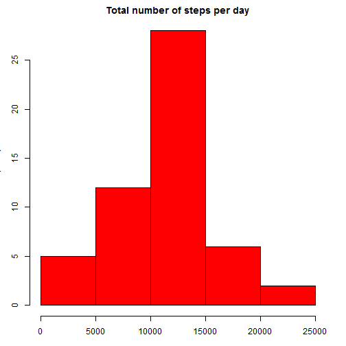
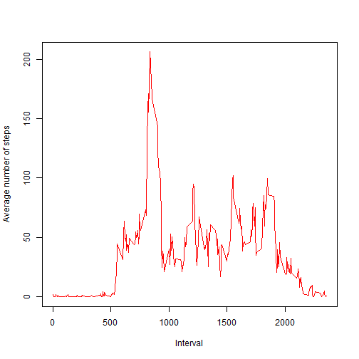
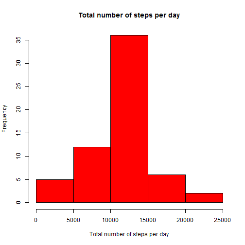
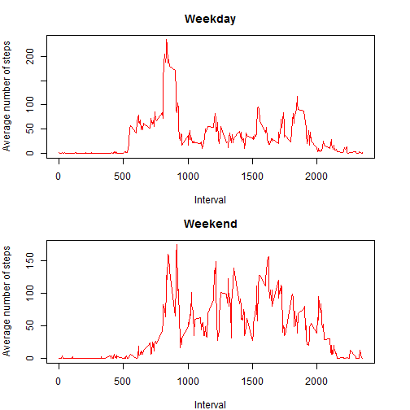

Intro
=================================================================================


This is an analysis of data from a personal activity monitoring device, which collects data at 5 minute intervals throughout the day.  
The data consists of two months of data from an anonymous individual collected during the months of October and November, 2012 and include the number of steps taken in 5 minute intervals each day.


Loading and preprocessing the data
=================================================================================

Here is the code downloading, unzipping and reading the data to R. Also transforming date field from factor to date is performed.


```r
filename <- "repdata-data-activity.zip"

## Download the file
if (!file.exists(filename)){
    fileURL <- "https://d396qusza40orc.cloudfront.net/repdata%2Fdata%2Factivity.zip"
    download.file(fileURL, filename)
}  

## Uncompress the files
if (!file.exists("repdata-data-activity")) { 
    unzip(filename) 
}

##Read data
data <- read.csv("activity.csv")
data <- transform(data, date = as.Date(date))
```


What is mean total number of steps taken per day?
=================================================================================
  
This is the distribution of the total number of steps taken each day:


```r
library(plyr)
```


```r
summary_day<- ddply(data, "date", summarise, total_steps = sum(steps)) ##new data frame with total number of steps per day

par(mfrow = c(1, 1), mar = c(3, 3, 2, 2))
hist(summary_day$total_steps,
     col = "red",
     main="Total number of steps per day",
     xlab="Total number of steps per day",
     ylab="Frequency")
```

 


```r
mean_steps<-format(mean(summary_day$total_steps, na.rm=TRUE),digits = 1,nsmall=1)
median_steps<-format(median(summary_day$total_steps,na.rm=TRUE),digits = 1,nsmall=1)
```

The mean number of steps taken per day is 10766.2 and the median is 10765.


What is the average daily activity pattern?
=================================================================================
  
This is the the distribution of the  number of steps taken for time intervals (average across  all days in the dataset):

```r
summary_interval<- ddply(data, "interval", summarise, average_steps = mean(steps, na.rm=TRUE)) ##new data frame with avg number of steps per interval

plot(summary_interval$interval,summary_interval$average_steps,
     type="l",
     col='red',
     ylab="Average number of steps",
     xlab="Interval")
```

 

```r
max_interval<-summary_interval[summary_interval$average_steps==max(summary_interval$average_steps), 1]
```

On average across all the days in the dataset, interval 835 contains the maximum number of steps.


Imputing missing values - effect on the results
=================================================================================
  

```r
mis_val <- sum(is.na(data)) ##calculating number of missing values
```
The dataset contains 2304 missing values (missing number of steps).  

Missing values for steps are here replaced with average number of steps for given interval.


```r
impute.mean <- function(x) replace(x, is.na(x), mean(x, na.rm = TRUE)) 
data_imput<-ddply(data, "interval" , transform, steps = impute.mean(steps)) ##data with  missing values in steps replaced with mean for interval
```

After inputing missing data values, the distribution of the total number of steps taken each day is following:


```r
summary_day_imput<- ddply(data_imput, "date", summarise, total_steps = sum(steps)) ##new data frame with total number of steps per day

hist(summary_day_imput$total_steps,
     col = "red",
     main="Total number of steps per day",
     xlab="Total number of steps per day",
     ylab="Frequency")
```

 


```r
mean_steps_imput<-format(mean(summary_day_imput$total_steps, na.rm=TRUE),digits = 1,nsmall=1)
median_steps_imput<-format(median(summary_day_imput$total_steps,na.rm=TRUE),digits = 1,nsmall=1)
```
After imputing missing values:  
-the mean number of steps taken per day is 10766.2 (before imputing it was 10766.2)  
-the median is 10766.2 (before imputing it was 10765)

  
Are there differences in activity patterns between weekdays and weekends?
=================================================================================
  
There is a difference in distribution of average number of steps taken between weekdays and weekend. On weekends the activity (average number of steps) are evenly distributed throughout the day while on weekdays there is a clear peak in activity (around 800 interval)


```r
data <- transform(data, daytype = ifelse(weekdays(data$date) %in% c("sobota","niedziela"),"Weekend", "Weekday")) #calculating daytype variable (weekdays /weekends)

summary_interval_daytype<- ddply(data, c("interval","daytype"), summarise, average_steps = mean(steps, na.rm=TRUE)) ##new data frame with avg number of steps per interval


par(mfrow = c(2, 1), mar = c(4, 4, 3, 3))

with(subset(summary_interval_daytype, daytype== "Weekday"), plot(interval, average_steps,
                                             main = "Weekday",
                                             type="l",
                                             col='red',
                                             ylab="Average number of steps",
                                             xlab="Interval"))

with(subset(summary_interval_daytype, daytype== "Weekend"), plot(interval, average_steps,
                                             main = "Weekend",
                                             type="l",
                                             col='red',
                                             ylab="Average number of steps",
                                             xlab="Interval"))
```

 

